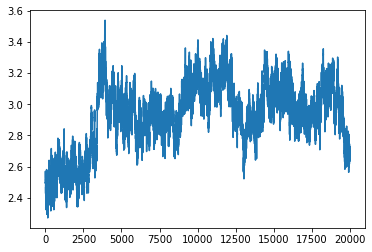
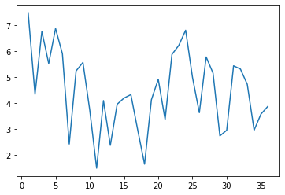

# RMSDとRMSF

シミュレーションを実施したときは、必ずそのシミュレーションが正確に行われたか、不自然な振る舞いをしていないか確認する必要がある。RMSDとRMSFはこのときよく使われる指標の一つである。RMSDとRMSFはそれぞれ Root Mean Square of Deviation と Root Mean Square of Fluctuation の略である。以下に定義を示す。

\\[ \rm{RMSD} = \min_{trans, rot} \sqrt{\frac{1}{N}\sum d^2} \\]

\\[ \rm{RMSF_j} = \sqrt{\langle \left(R_j - \langle R_j \rangle\right)^2 \rangle} \\]

RMSDの表示に用いた\\(d\\)は座標と座標の間の距離を示す。RMSFの表示に用いた\\(R_j\\)は座標を示している。

これだけだとパッとはわからないので、それぞれ説明する。

## RMSD

RMSDは、ある参照となる構造、例えばそのシミュレーションの最初の構造や、構造最適化が終わった構造、あるいは単に結晶構造解析の結果得られた構造と比較して、構造がどれだけ変化したかを示す。

定義の説明で、\\(d\\)をなにとなにの間の座標か示さなかったのだが、RMSDはいろいろな距離で計算することが多い。例えばタンパク質の主鎖の\\(\rm{C}_\alpha\\)原子の座標同士の距離でRMSDを計算すれば、主鎖がどれだけ変化したかという情報だけを抜き取ることができ、変化の大きい側鎖の影響を忘れることができる。逆に側鎖の情報も取り入れたいときは、アミノ酸残基ごとの重心の距離を比較すればいい。

\\[ d = R - R_{ref} \\]
\\[ \rm{RMSD} = \min_{trans, rot} \sqrt{\frac{1}{N}\sum d^2} \\]

さて、実際のケースで考えてみよう。今あなたの手元には、36残基のタンパク質、1VIIのシミュレーション結果があるとしよう。AMBERで得られた計算結果なので、cpptrajでRMSDとRMSFを計算するのが簡単だろう。このときのcpptrajへのコマンド入力は以下のようになる。

```cpptraj.in
# Load parameters, trajectory, and reference structure
parm system.prmtop
trajin md.crd.nc
reference system.crd [crd]

# Calculate RMSD
rmsd rmsd_all  ref [crd] :1-36&!@H= out rmsd_mass_all.agr 
rmsd rmsd_c_alpha ref [crd] @CA out rmsd_c_alpha.agr

run
quit
```

順に説明しよう。以下に最初のコードブロックを抜き出した。

```cpptraj_head.in
# Load parameters, trajectory, and reference structure
parm system.prmtop
trajin md.crd.nc
reference system.crd [crd]
```

ここでは、次のように、このあとRMSDを計算するための準備をしている。

1. `parm system.prmtop`でシステムの基本情報を読み込む。原子の名前、各原子がどの残基に所属するか、原子の質量や電荷など。
2. `trajin md.crd.nc`でシミュレーションによって得られた軌道情報を読み込む。
3. `reference system.crd [crd]`でRMSDを計算するための参照構造を読み込む。ここではminimizationする前の、結晶構造解析によって得られた構造を、Leapで加工した構造を読み込んでいる。

次のコードブロックでは、実際にRMSDを計算している。

```cpptraj_calculate
# Calculate RMSD
rmsd rmsd_all  ref [crd] :1-36&!@H= out rmsd_mass_all.agr 
rmsd rmsd_c_alpha ref [crd] @CA out rmsd_c_alpha.agr
```

先にrmsdコマンドの文法を確認しておく。

```
rmsd <name> ref <reference name> <range> out <filename>
```

`<name>`はあとの利便性のために、そのRMSDの名前を宣言する。`rmsd_all`, `rmsd_c_alpha` が対応する。

`ref`の次の`<reference name>`では、参照構造を指定する。準備のコードブロックにおいて、`reference`コマンドでファイルを指定し、`[crd]`と名づけたものを、ここで指定している。

`<range>`は少々やっかいであるが、これはRMSDを計算する残基や原子を指定する箇所である。この指定方法の詳細はAmberのmanualを確認してほしいのだが、

- `:1-36&!@H=`は`:1-36`で残基番号1から36、この場合タンパク質だけを取りだしたのち、そこから水素だけは省くという指定。
- `@CA`は\\(\rm{C\alpha}\\)だけ取り出す（それ以外のものは省く）という指定。

となっている。

最後に`out`に続けて出力先のファイル名を指定して、rmsdコマンドは終わりである。その他にもいろいろなオプションがあるが、簡単にシミュレーションの結果を確認するだけならこれで十分なことが多い。

最初に示したものを`cpptraj_rmsd.in`として保存すれば、以下のようにして実行できる。

```console
cpptraj -i cpptraj_rmsd.in
```

実行すると、ファイルを読み込んで、順に処理していく様子が確認できるはずだ。実行が正常に完了すれば、カレントディレクトリに`rmsd_mass_all.agr`と`rmsd_c_alpha.agr`の二つのファイルが出力されている。

中身を確認すると、以下のようになっている。

```dat
@with g0
@  xaxis label "Frame"
@  yaxis label ""
@  legend 0.2, 0.995
@  legend char size 0.60
@  s0 legend "rmsd_all"
@target G0.S0
@type xy
    1.000       2.5316
    2.000       2.5700
    3.000       2.5328
    4.000       2.5624
    5.000       2.5104
    6.000       2.5259
    7.000       2.4947
    8.000       2.4968
    9.000       2.4982
   10.000       2.4898
   11.000       2.5248
   12.000       2.4692
```

大事なのは`    1.000       2.5316`以降の行である。左の列がフレーム番号、右の列がそのフレーム時点でのRMSDを示している。cpptrajの場合、RMSDの単位はオングストローム。

これだけだとなんのインサイトも得られないので、グラフ化する。実はcpptrajの`.agr`フォーマットは対応するソフトウェアがあり、それに読み込ませることでグラフ生成してくれるのだが、あまり汎用性がないのでpythonで処理してしまうことにする。同じディレクトリに次のpythonファイルを`plot_rmsd.py`と保存して、`python plot_rmsd.py`として実行しよう。

```python
import pandas as pd
import matplotlib.pyplot as plt

# Specity input and output
rmsd_file = "rmsd_mass_all.agr"
output_image_file = "rmsd_all.png"

df = pd.read_table(
    rmsd_file,
    skiprows=8,
    names=["frame", "rmsd"],
    delim_whitespace=True
)

fig, ax = plt.subplots()
fig.patch.set_facecolor("white")
ax.plot(df["frame"], df["rmsd"])

plt.savefig(output_image_file)
```

このように実行すると、`rmsd_all.png`はこのようなグラフになっている。



横軸は各フレーム、縦軸はRMSD、単位はオングストローム。

このシミュレーションは2000000ステップ（200万ステップ）なのだが、シミュレーション中100ステップに一回座標を出力させていたため、20000ステップそれぞれのRMSDが計算され、そのままグラフとして表示された。

ここで一つ注意がある。それは、RMSDは各フレームに対して一つの値が計算されるということである。これは、この後説明するRMSFと大きく違うことを、頭の片隅にいれておいていただきたい。

## RMSF

RMSFは、あるアミノ酸残基、アミノ酸側鎖などが、どれだけ揺らいだか（Fluctuation）を測る指標となる。定義を再度示そう。

\\[ \rm{RMSF_j} = \sqrt{\langle \left(R_j - \langle R_j \rangle\right)^2 \rangle} \\]

ここで\\(\rm{j}\\)とおいたのは、たとえばアミノ酸残基の重心座標であったり、アミノ酸側鎖の重心座標であることが多い。論文によっては、RMSFの大きさによって、そのアミノ酸残基や側鎖のタンパク質の機能における役割、またはその重要性について議論されていることもある。（要出典）

さて、ここでRMSDとRMSFの対比を行っておこう。RMSDはさきほど見たとおり、各フレームに対して計算されるものであった。一方のRMSFは、シミュレーション全体を通して、あるグループ（側鎖や残基）に対して一つの値が計算される。

これも実際の例で見てみよう。RMSDの計算で用いたcpptrajを使い、計算する。

```cpptraj.in
# Load parameters, trajectory, and reference structure
parm system.prmtop
trajin md.crd.nc
reference system.crd [crd]

# Calculate RMSF
rmsf side :1-36&!@N,H,CA,HA,C,O= byres out rmsf_residue.agr

run
quit
```

最初の4行はRMSDと同じで、違うのは

```cpptraj
# Calculate RMSF
rmsf side :1-36&!@N,H,CA,HA,C,O= byres out rmsf_side.agr
```

のところである。構文の説明を端折るが、`byres`という指定をすることで、アミノ酸残基ごとに値を計算してくれるようになる。しかしこの場合原子の指定で主鎖の原子を全て取り除くように指定しているため、結果的に各側鎖だけのRMSFを計算することになる。

これも`cpptraj -i cpptraj_rmsf.in`として実行することで、`rmsf_side.agr`が出力される。

以下にその様子を示す。

```dat
@with g0
@  xaxis label "Res"
@  yaxis label ""
@  legend 0.2, 0.995
@  legend char size 0.60
@  s0 legend "RESIDUE"
@target G0.S0
@type xy
   1.000       7.4736
   2.000       4.3284
   3.000       6.7539
   4.000       5.5169
   5.000       6.8677
   6.000       5.8924
   7.000       2.4126
   8.000       5.2326
   9.000       5.5578
  10.000       3.7109
  11.000       1.4804
  12.000       4.0884
```

グラフ化してみよう。

```python
import pandas as pd
import matplotlib.pyplot as plt

# Specity input and output
rmsf_file = "rmsf_residue.agr"
output_image_file = "rmsf_side.png"

df = pd.read_table(
    rmsf_file,
    skiprows=8,
    names=["residue number", "rmsf"],
    delim_whitespace=True
)

fig, ax = plt.subplots()
fig.patch.set_facecolor("white")
ax.plot(df["residue number"], df["rmsf"])

plt.savefig(output_image_file)
```



縦軸はRMSFで単位はオングストローム、横軸は1始まり36終わりのアミノ酸残基番号に対応する。

アミノ酸残基の数である36と同じところまであることを確認されたい。これでたしかに各残基ごと（この場合側鎖ごど）に結果が得られたことがわかる。

RMSFは一般にN末端とC末端、また、二次構造を作っていない箇所で大きくなりやすい。実際にこのデータでもN末端（1側）は大きくなっている。

さて、RMSFもタンパク質の動的な性質を示すために利用されるが、もっとインスタントに、計算結果の妥当性の評価にも利用される。具体的には、N末端とC末端を除いた箇所で、RMSFが大きな値を取っていないか確認するために利用される。この視点で見ると、今回のシミュレーションのRMSFは**かなり大きい**。このシミュレーションではタンパク質が小さく、かつ、残基ではなく、ゆらぎの大きい側鎖のRMSFを計算したからこのような結果になったのだと推察するが、それにしても大きい。こういうデータがあなたの計算で得られたのなら、一度先生や先輩と相談することを強く推奨する。計算の仕方にもよるが、RMSFが5以下はまあまあいいかな、5周辺をうろちょろしていたり、6, 7を叩くようだと、red flagとなる。もちろん、本質的にゆらぎの大きいN末端やC末端が6, 7近いのは仕方ないので、restrainでもかけていない場合は大きな値を取っていてももっぱら無視される。
